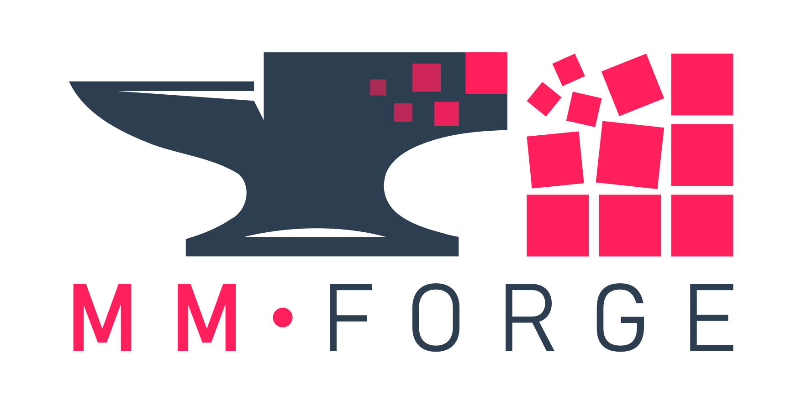

# MMForge

**Your Mueller Matrix Workbench** — calibration, processing and analysis for
Mueller matrix spectroscopic polarimetry, in your web browser.



MMForge is a desktop application for the Eigenvalue Calibration Method (ECM).
It calibrates a Mueller matrix spectroscopic ellipsometer in **transmission** or
**reflection** mode, processes sample measurements into Mueller matrices, and
analyses them with four decompositions — Lu-Chipman polar, differential
(Minkowski), Cloude spectral and purity space.

> **Instrument-specific.** The ECM algorithm imposes requirements on the
> instrument design. This release targets the custom-built polarimeter at the
> Department of Optics, Palacký University Olomouc, and may not work correctly
> on other instruments without modification.

**Version 2.1.0** · built on ECM-Calibration 8.0.0 · Windows and macOS ·
Python 3.10 or newer

---

## Before you start

You need three things:

| | |
|---|---|
| **Python 3.12** | A free download from [python.org](https://www.python.org/downloads/). Installing it is step 1 below. |
| **About 1 GB of free disk space** | MMForge itself is small; the Python packages are the bulk of it. |
| **About 10 minutes, once** | After the first setup you just double-click an icon. |

You do **not** need Anaconda, VS Code, or any knowledge of the terminal.

---

## Install — Windows

You only do steps 1 to 3 **once**. After that, MMForge starts from a Desktop
icon.

### Step 1 — Install Python

1. Go to [python.org/downloads](https://www.python.org/downloads/).
2. Click the big yellow **Download Python** button.
3. Run the file you downloaded.
4. On the very first screen, tick **Add python.exe to PATH**, then click
   **Install Now**.

> Already have Python? Skip this step. The installer will tell you if the
> version is too old.

### Step 2 — Download MMForge

Choose whichever is easier for you.

**Option A — download a ZIP** (nothing extra to install)

1. Open <https://github.com/DanielVala-UPOL/mmforge>.
2. Click the green **Code** button, then **Download ZIP**.
3. Right-click the downloaded ZIP and choose **Extract All**.
4. Move the extracted folder somewhere sensible, for example `C:\MMForge`.

**Option B — use git** (makes updating easier later)

```
git clone https://github.com/DanielVala-UPOL/mmforge.git C:\MMForge
```

> Avoid putting MMForge inside a OneDrive folder. Syncing thousands of small
> files slows the installation down and can make it fail.

### Step 3 — Run the installer

1. Open the MMForge folder.
2. Double-click **`Install-Windows.bat`**.
3. A black window opens and prints its progress. Installing the packages takes
   a few minutes.
4. When it asks *Create a desktop shortcut for MMForge?*, press **Enter**.
5. Wait for **Setup complete**, then press any key to close the window.

### Step 4 — Start MMForge

Double-click the **MMForge** icon on your Desktop.

A black window opens — that is the MMForge server. Leave it open. Your browser
opens automatically at <http://localhost:8501>.

---

## Install — macOS

You only do steps 1 to 3 **once**. After that, MMForge starts from your
Applications folder.

### Step 1 — Install Python

1. Go to [python.org/downloads/macos](https://www.python.org/downloads/macos/).
2. Download the **macOS 64-bit universal2 installer**.
3. Open the downloaded `.pkg` file and click through the installer.

> Already have Python 3.10 or newer? Skip this step.

### Step 2 — Download MMForge

Choose whichever is easier for you.

**Option A — use git** (recommended on macOS — it avoids a security warning
in step 3)

```
git clone https://github.com/DanielVala-UPOL/mmforge.git ~/MMForge
```

**Option B — download a ZIP**

1. Open <https://github.com/DanielVala-UPOL/mmforge>.
2. Click the green **Code** button, then **Download ZIP**.
3. Double-click the downloaded ZIP to unpack it.
4. Move the resulting folder to your home folder, for example `~/MMForge`.

> Avoid putting MMForge inside iCloud Drive or your Desktop/Documents folder if
> those are synced to iCloud. Syncing thousands of small files slows the
> installation down and can make it fail.

### Step 3 — Run the installer

1. Open the MMForge folder in Finder.
2. **Right-click** `Install-macOS.command` and choose **Open**.
3. macOS may warn that the file is from an unidentified developer. Click
   **Open** again to confirm. *(This warning appears only for files that came
   from a downloaded ZIP. You will not see it if you used git.)*
4. A Terminal window opens and prints its progress. Installing the packages
   takes a few minutes.
5. When it asks *Create a desktop shortcut for MMForge?*, press **Return**.
6. Wait for **Setup complete**, then press **Return** to close the window.

### Step 4 — Start MMForge

1. Open **Finder** → **Go** → **Applications**.
2. Double-click **MMForge**.

A Terminal window opens — that is the MMForge server. Leave it open. Your
browser opens automatically at <http://localhost:8501>.

> **Tip:** drag the MMForge icon onto your Dock to keep it one click away.

---

## Using MMForge

**Starting** — double-click the MMForge icon.

**While it runs** — a black window (Windows) or Terminal window (macOS) stays
open. That window *is* the application. Minimise it if it is in the way, but do
not close it while you are working.

**Stopping** — close that window, or click it and press `Ctrl+C`.

**Where results go** — MMForge suggests `MMForge_output` in your home folder.
You can change this in the **Output Directory** box on the Configuration page.

**The workflow** — the pages in the sidebar are meant to be used in order:

1. **CONFIGURATION** — choose transmission or reflection, point MMForge at your
   measurement folder
2. **CALIBRATION** — run the ECM calibration, or load a saved one
3. **PROCESSING** — turn sample measurements into Mueller matrices
4. **PARAMETERS** — run the decompositions and export results

---

## Try it without your own data

MMForge ships with a small transmission dataset so you can see the whole
workflow before using real measurements.

1. Go to the **CONFIGURATION** page.
2. Set **Calibration Mode** to **Tutorial Data**.
3. Carry on to CALIBRATION and PROCESSING as normal.

Saving and exporting are disabled in Tutorial mode. The bundled data is for
demonstration only — always validate against your own measurements.

---

## Updating to a newer version

**If you used git:**

```
git pull
```

**If you downloaded a ZIP:** download the new ZIP, unpack it, and copy your old
`.venv` folder across — or simply run the installer again.

Then, on either platform, run the installer once more
(`Install-Windows.bat` or `Install-macOS.command`). It reuses the existing
environment and only installs what changed.

---

## Troubleshooting

<details>
<summary><b>Nothing happens when I double-click the icon</b></summary>

The shortcut points at a fixed location. If you moved or renamed the MMForge
folder, it no longer resolves.

Open the MMForge folder and run the installer again. It rebuilds the shortcut
with the new path.
</details>

<details>
<summary><b>"The MMForge Python environment is missing"</b></summary>

The `.venv` folder was never created, or was deleted.

Run `Install-Windows.bat` / `Install-macOS.command` once and try again.
</details>

<details>
<summary><b>"Python was not found on this computer" (Windows)</b></summary>

Either Python is not installed, or it was installed without being added to
PATH.

Reinstall Python from [python.org](https://www.python.org/downloads/) and make
sure **Add python.exe to PATH** is ticked on the first screen of the installer.

If Windows opens the Microsoft Store when you type `python`, that is a
placeholder rather than a real Python. The python.org installer replaces it.
</details>

<details>
<summary><b>macOS says the file is from an unidentified developer</b></summary>

macOS blocks scripts that arrived inside a downloaded ZIP.

**Right-click** the file in Finder, choose **Open**, then click **Open** in the
dialog. You only need to do this once per file.

To avoid the warning entirely, download MMForge with `git clone` instead.
</details>

<details>
<summary><b>The browser does not open</b></summary>

The server is probably running anyway. Open your browser and go to:

```
http://localhost:8501
```

If the launcher window reported a different port number, use that one instead.
</details>

<details>
<summary><b>"Port 8501 was busy, using 8502 instead"</b></summary>

This is not an error — MMForge is telling you it found the usual port occupied
and moved to the next one. Usually it means MMForge is already running in
another window.
</details>

<details>
<summary><b>Windows Firewall asked for permission</b></summary>

MMForge listens only on your own computer (`127.0.0.1`), so it should not
trigger a prompt. If something else caused one, you can safely decline —
MMForge does not need network access.
</details>

<details>
<summary><b>The installation is very slow, or fails part-way</b></summary>

Two common causes:

- **MMForge is in a synced folder** (OneDrive, iCloud, Dropbox). Move it to a
  plain local folder such as `C:\MMForge` or `~/MMForge` and install again.
- **A company or university proxy is blocking pypi.org.** The installer prints
  the exact error from pip; that message is what your IT department needs.
</details>

<details>
<summary><b>It worked before and now it does not</b></summary>

Run the installer again. It is safe to re-run at any time and repairs most
problems.

If that is not enough, rebuild the environment from scratch:

**Windows** — open the MMForge folder, hold `Shift`, right-click an empty area,
choose *Open PowerShell window here*, then:

```
.\Install-Windows.bat --recreate
```

**macOS** — open Terminal, then:

```
cd ~/MMForge
./Install-macOS.command --recreate
```
</details>

---

## For developers

The launchers are a convenience layer, not a requirement. MMForge is an
ordinary Streamlit application.

**Manual setup**

```bash
python -m venv .venv
.venv/bin/python -m pip install -r requirements.txt      # Windows: .venv\Scripts\python.exe
```

**Run it**

```bash
.venv/bin/python -m streamlit run streamlit_app/HOME.py
```

Note that the launchers pass `--server.headless true` and open the browser
themselves. Without it, Streamlit stops on a first-run e-mail prompt on a
machine where it has never run before.

**VS Code** — open the project folder, then `Ctrl+Shift+P` →
*Python: Select Interpreter* → choose the one inside `.venv`.

**Layout**

```
ecm/              the ECM algorithm library (versioned separately, 8.0.0)
streamlit_app/    the GUI: HOME.py plus five pages
data/assets/      bundled reference data the app reads at runtime
data/tutorial/    bundled demonstration dataset
tools/            launcher and installer internals
```

`CLAUDE.md` documents the architecture, conventions and the non-obvious
pitfalls. `CHANGELOG.md` records what changed in each release.

---

## Citation and licence

MMForge implements published methods; please cite them alongside it. The
references and the licence terms are in [LICENSE](LICENSE), and the About page
inside the application lists them too.

Copyright © 2026 Daniel Vala, Department of Optics, Palacký University Olomouc.
All rights reserved.

Questions, bug reports and collaboration requests:
[daniel.vala@upol.cz](mailto:daniel.vala@upol.cz)
